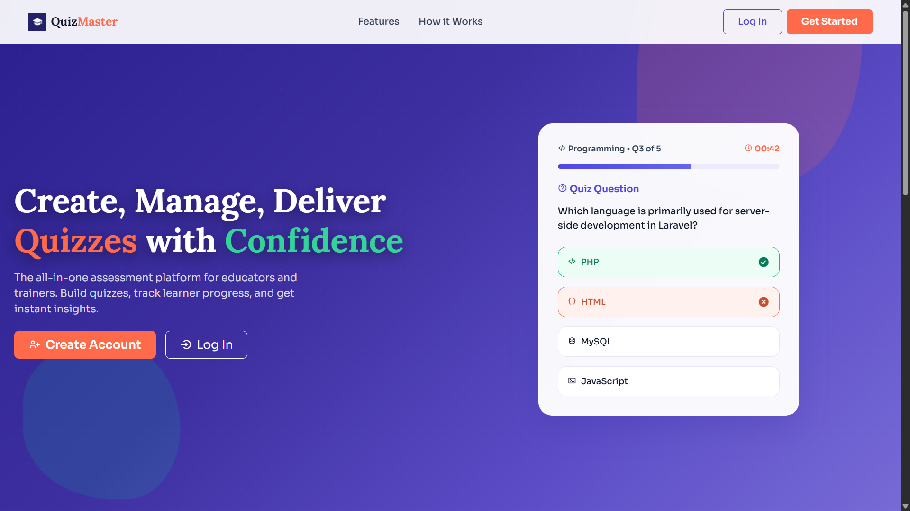
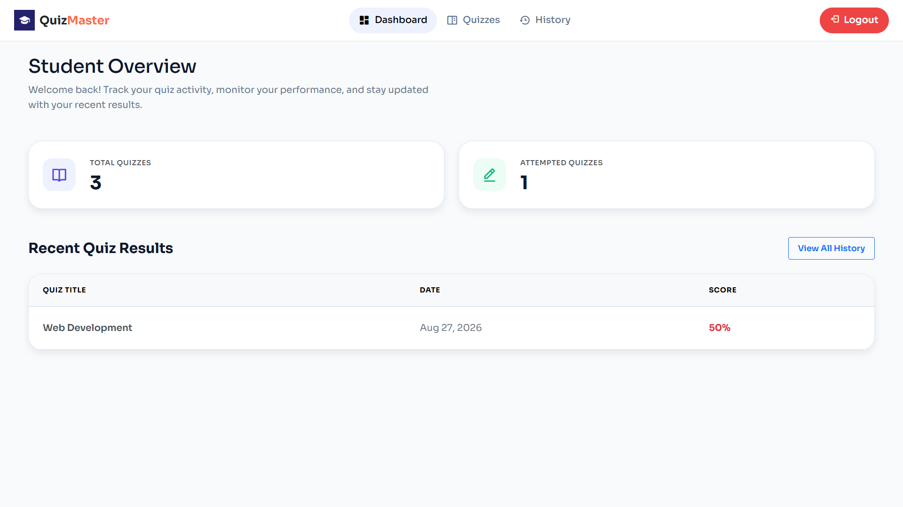
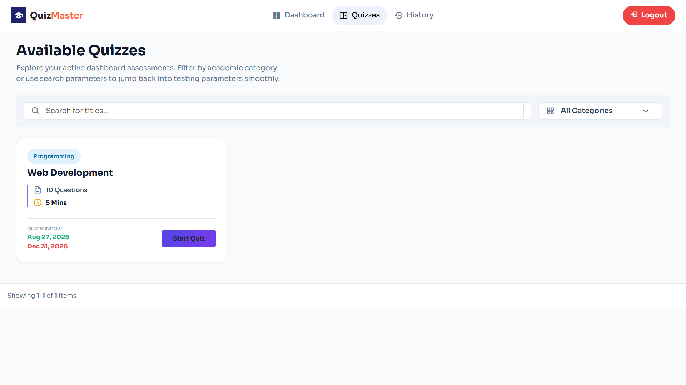
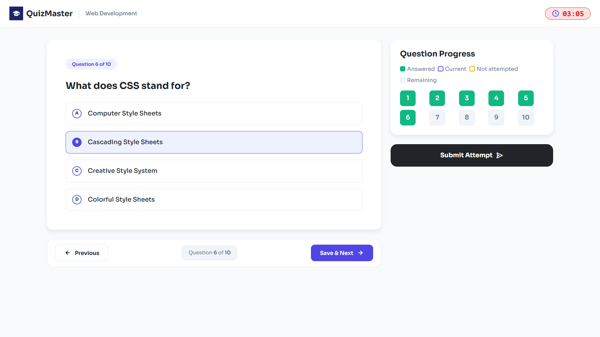
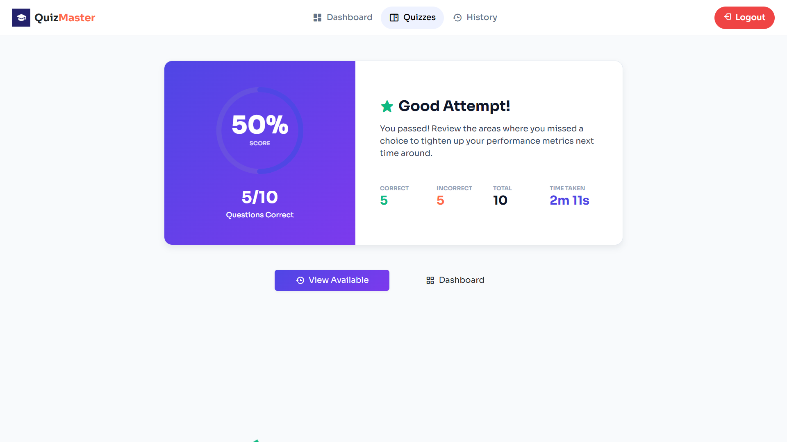
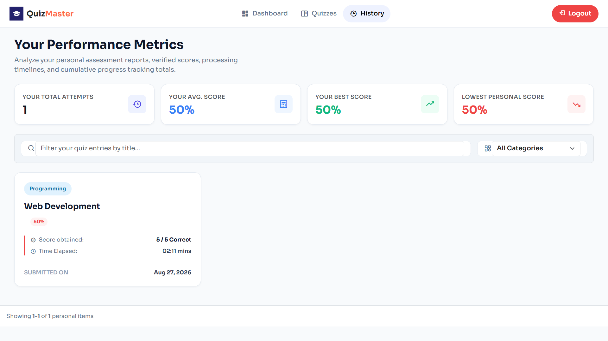
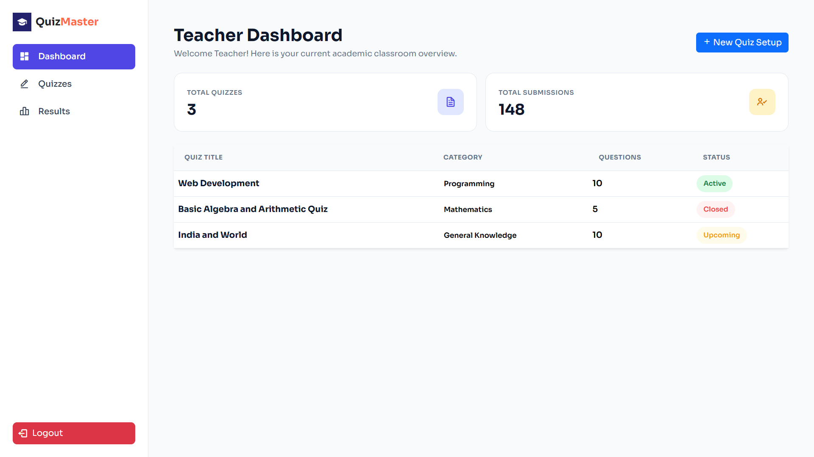
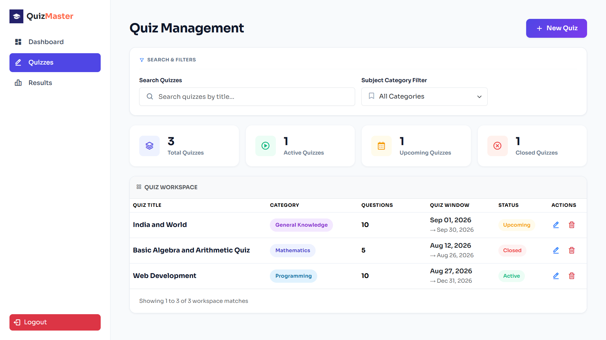
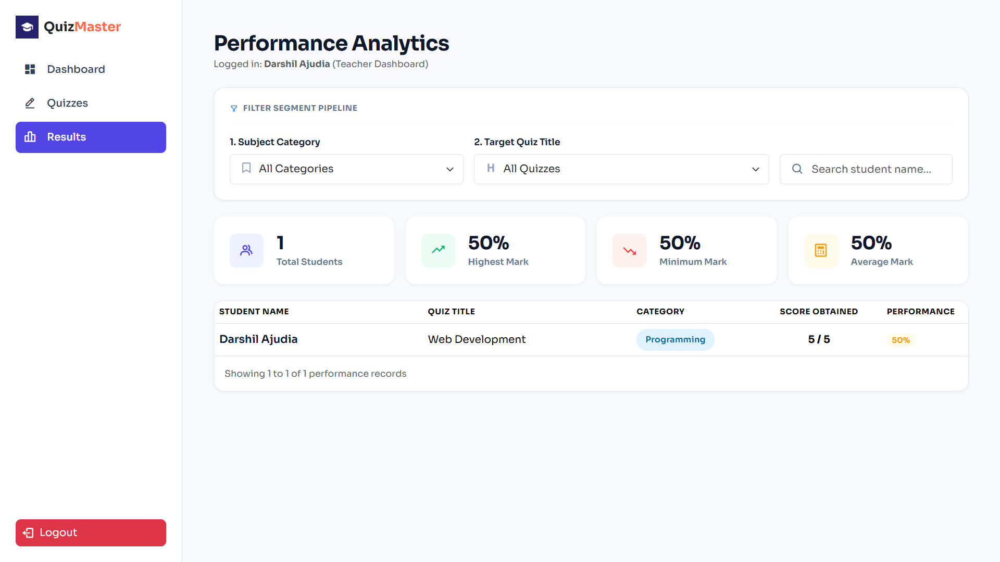

# 🎓 QuizMaster

An all-in-one assessment and quiz platform designed for educators and learners. Create, manage, and take interactive timed quizzes with real-time analytics and detailed performance tracking.

---

## 🚀 Features

### 👨‍🏫 Teacher / Admin Dashboard
* **Quiz Management:** Create, edit, and delete quizzes across categories
* **Schedule Quizzes:** Set active quiz windows with start and end dates.
* **Status Tracking:** View quizzes organized by *Active*, *Upcoming*, and *Closed* status.
* **Performance Analytics:** Filter results by subject category, quiz title, or student name.
* **Batch Insights:** View aggregate statistics including Total Students, Highest Mark, Minimum Mark, and Average Mark.

### 👨‍🎓 Student Dashboard
* **Interactive Quiz Interface:** Timed quiz sessions with countdown timers and question pagination (`Save & Next`, `Previous`).
* **Progress Navigation:** Color-coded question status map (*Answered*, *Current*, *Not Attempted*, *Remaining*).
* **Instant Scorecards:** Post-quiz performance reviews detailing correct answers, incorrect answers, score percentage, and time taken.
* **Personal History:** Track individual quiz attempts, overall averages, best scores, and completion timelines.

---

## 🛠️ Tech Stack

* **Frontend:** HTML5, CSS3 , Bootstrap, JavaScript
* **Backend:** PHP / Laravel
* **Database:** MySQL
* **Authentication:** Role-Based Access Control (Teacher / Student)

---

## 📸 Screenshots

### 🏠 Landing Page

| Landing Page |
| :---: |
|  |

---

### 👨‍🎓 Student Dashboard

| Student Dashboard | Available Quiz |
| :---: | :---: |
|  |  |

| Attempt Quiz | Student Result |
| :---: | :---: |
|  |  |

| Student History |
| :---: |
|  |

---

### 👨‍🏫 Teacher Dashboard

| Teacher Dashboard | Quiz Management |
| :---: | :---: |
|  |  |

| Result Management |
| :---: |
|  |
